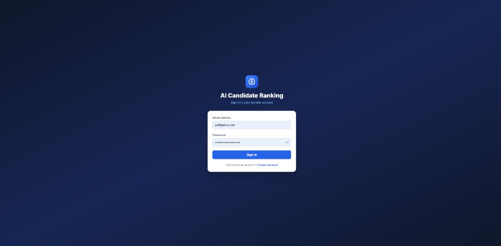
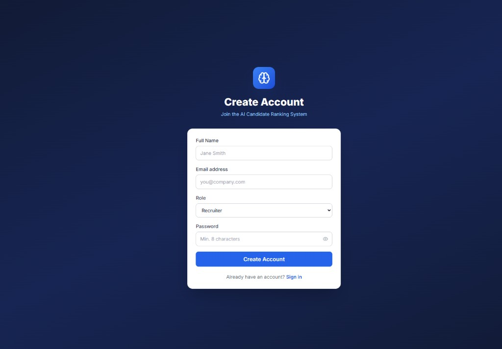
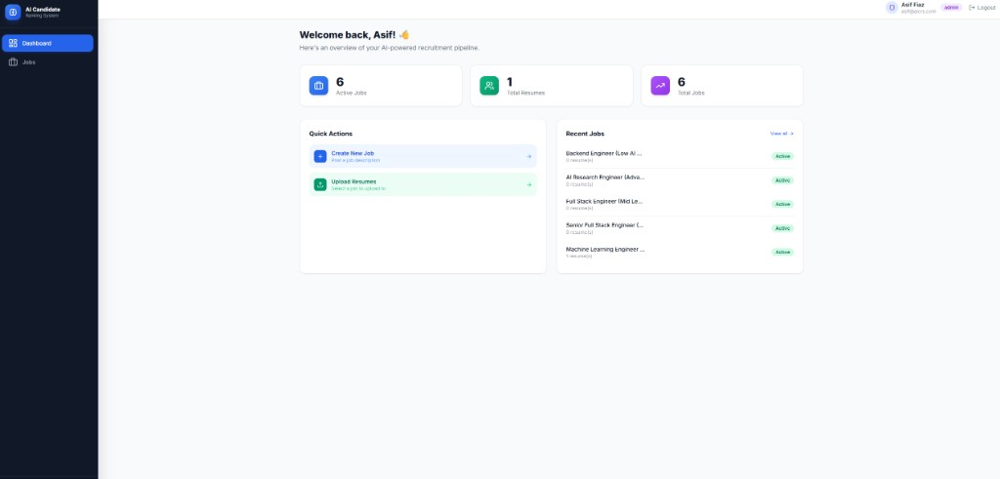
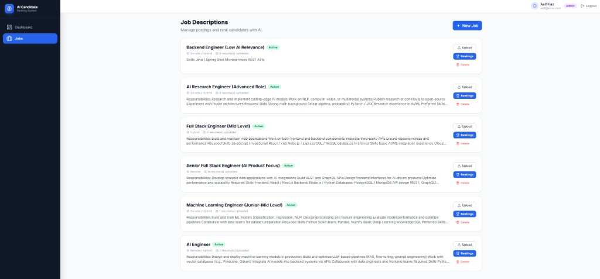
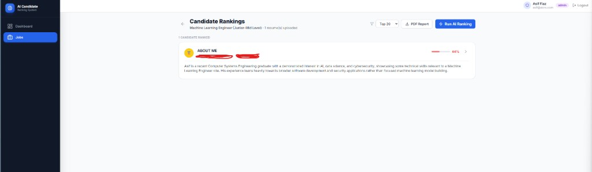
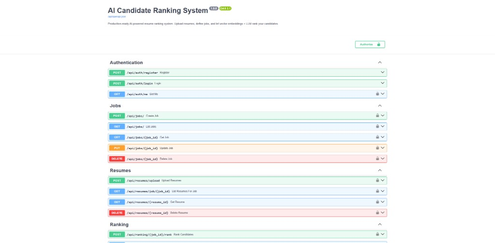

# 🤖 AI Candidate Ranking System

A **production-ready, full-stack SaaS** application that uses vector embeddings and a local LLM to automatically rank job candidates based on how well their resumes match a job description.

---

## ✨ Features

| Category | Feature |
|---|---|
| **Auth** | JWT authentication · bcrypt passwords · Role-based access (Admin / Recruiter) |
| **Jobs** | Create, edit, delete job descriptions with requirements, location, salary |
| **Resumes** | Bulk PDF upload · PyMuPDF text extraction · Candidate info parsing |
| **AI Ranking** | Sentence-Transformer embeddings · Qdrant vector search · Cosine similarity scoring |
| **LLM Summaries** | Candidate summary · Strengths · Weaknesses · Match explanation (Ollama) |
| **Dashboard** | Modern React UI · Ranked candidate cards · Score visualisation |
| **Reports** | One-click PDF ranking report (ReportLab) |
| **Filtering** | Top 5 / 10 / 20 / 50 / 100 candidate filter |
| **DevOps** | Docker + docker-compose · Nginx SPA proxy · Health checks |

---

## 🏗️ Architecture

```
┌─────────────────────────────────────────────────────────────┐
│                        Browser (React/Vite)                  │
│  Login → Dashboard → Jobs → Upload Resumes → Rankings        │
└───────────────────────────┬─────────────────────────────────┘
                            │ HTTP / REST
                  ┌─────────▼──────────┐
                  │   Nginx (port 3000) │  ← serves React SPA
                  │   /api → proxy     │
                  └─────────┬──────────┘
                            │
                  ┌─────────▼──────────┐
                  │  FastAPI (port 8000)│
                  │  ┌──────────────┐  │
                  │  │ Auth Router  │  │
                  │  │ Jobs Router  │  │
                  │  │Resume Router │  │
                  │  │Ranking Router│  │
                  │  │Report Router │  │
                  │  └──────────────┘  │
                  └──┬──────┬────┬─────┘
                     │      │    │
          ┌──────────▼┐  ┌──▼──┐ ┌▼────────┐
          │ PostgreSQL │  │Qdrant│ │ Ollama  │
          │  (Tables)  │  │(Vecs)│ │  LLM   │
          └────────────┘  └─────┘ └─────────┘
```

### Ranking Pipeline

```
Job Description
      │
      ▼  sentence-transformers
  Query Vector ──────────────► Qdrant similarity search
                                        │
  Resume PDFs                           │ top-K results + scores
      │                                 │
      ▼  PyMuPDF                        ▼
  Raw Text ──► embedding ──► Qdrant    DB update (scores)
                                        │
                                        ▼
                               Ollama LLM (top 10)
                                        │
                              Summary / Strengths / Weaknesses
```

---

## 📁 Project Structure

```
ai-candidate-ranking/
├── backend/
│   ├── app/
│   │   ├── core/           # Config, security, database
│   │   ├── models/         # SQLAlchemy ORM models
│   │   ├── schemas/        # Pydantic request/response schemas
│   │   ├── services/       # Business logic (PDF, embedding, LLM, ranking, report)
│   │   ├── routers/        # FastAPI route handlers
│   │   ├── dependencies.py # Auth dependencies
│   │   └── main.py         # App factory + lifespan
│   ├── requirements.txt
│   ├── Dockerfile
│   └── .env.example
├── frontend/
│   ├── src/
│   │   ├── components/     # Reusable UI components
│   │   ├── pages/          # Route-level page components
│   │   ├── services/       # Axios API clients
│   │   ├── context/        # AuthContext
│   │   └── hooks/          # Custom React hooks
│   ├── Dockerfile
│   ├── nginx.conf
│   └── package.json
├── docker-compose.yml
├── .env.example
└── README.md
```

---

## 🚀 Quick Start (Docker)

### 1. Prerequisites

- [Docker Desktop](https://www.docker.com/products/docker-desktop/) installed and running
- 8 GB+ RAM recommended (LLM inference)

### 2. Clone & configure

```bash
git clone https://github.com/youruser/ai-candidate-ranking.git
cd ai-candidate-ranking

# Create your environment file
cp .env.example .env
```

Edit `.env` with a secure `SECRET_KEY` and your preferred passwords:

```env
POSTGRES_PASSWORD=mysecurepassword
SECRET_KEY=a1b2c3d4e5f6a1b2c3d4e5f6a1b2c3d4e5f6a1b2c3d4e5f6a1b2c3d4e5f6
OLLAMA_MODEL=llama3
```

### 3. Start all services

```bash
docker-compose up --build -d
```

### 4. Pull the LLM model (one-time)

```bash
docker exec ranking_ollama ollama pull llama3
```

> ⚠️ This downloads ~4.7 GB. For a lighter model try `gemma2:2b` (~1.6 GB).

### 5. Open the app

| Service | URL |
|---|---|
| **Frontend** | http://localhost:3000 |
| **API Docs** | http://localhost:8000/api/docs |
| **Qdrant UI** | http://localhost:6333/dashboard |

---

## 💻 Local Development (without Docker)

### Backend

```bash
cd backend
python -m venv .venv
# Windows:
.venv\Scripts\activate
# Linux/Mac:
source .venv/bin/activate

pip install -r requirements.txt
cp .env.example .env   # edit with your local settings

# Start PostgreSQL and Qdrant locally (or use Docker)
docker run -d -p 5432:5432 -e POSTGRES_PASSWORD=postgres postgres:15-alpine
docker run -d -p 6333:6333 qdrant/qdrant

uvicorn app.main:app --reload --port 8000
```

### Frontend

```bash
cd frontend
npm install
npm run dev   # starts on http://localhost:5173
```

The Vite dev server proxies `/api` to `http://localhost:8000`.

---

## 📡 API Endpoints

### Authentication
| Method | Endpoint | Description |
|---|---|---|
| `POST` | `/api/auth/register` | Create account |
| `POST` | `/api/auth/login` | Login → JWT token |
| `GET` | `/api/auth/me` | Current user profile |

### Jobs
| Method | Endpoint | Description |
|---|---|---|
| `GET` | `/api/jobs` | List jobs |
| `POST` | `/api/jobs` | Create job |
| `GET` | `/api/jobs/{id}` | Get job detail |
| `PUT` | `/api/jobs/{id}` | Update job |
| `DELETE` | `/api/jobs/{id}` | Delete job + resumes |

### Resumes
| Method | Endpoint | Description |
|---|---|---|
| `POST` | `/api/resumes/upload` | Bulk PDF upload (multipart) |
| `GET` | `/api/resumes/job/{job_id}` | List resumes for job |
| `GET` | `/api/resumes/{id}` | Get single resume |
| `DELETE` | `/api/resumes/{id}` | Delete resume |

### Ranking
| Method | Endpoint | Description |
|---|---|---|
| `POST` | `/api/ranking/{job_id}/rank` | **Run AI ranking pipeline** |
| `GET` | `/api/ranking/{job_id}/results` | Cached ranking results |
| `GET` | `/api/ranking/{job_id}/candidate/{resume_id}` | Full AI candidate analysis |

### Reports
| Method | Endpoint | Description |
|---|---|---|
| `GET` | `/api/reports/{job_id}/download` | Download PDF ranking report |

---

## 🖼️ Screenshots

### Login & Registration
| | |
|---|---|
|  |  |
| Sign in to your recruiter account | Create a new Admin or Recruiter account |

### Dashboard

> Overview of active jobs, total resumes, and quick actions with recent job listings.

### Job Descriptions

> Manage job postings — create, edit, upload resumes, view rankings, or delete.

### AI Candidate Rankings

> AI-ranked candidates with cosine similarity scores for a selected job.

### API Documentation

> Interactive Swagger UI available at `/api/docs` — all endpoints documented and testable.

---

## ⚙️ Configuration Reference

| Variable | Default | Description |
|---|---|---|
| `DATABASE_URL` | `postgresql+asyncpg://...` | Async PostgreSQL connection string |
| `SECRET_KEY` | *(required)* | JWT signing secret — use 32+ random chars |
| `QDRANT_HOST` | `localhost` | Qdrant service hostname |
| `OLLAMA_BASE_URL` | `http://localhost:11434` | Ollama API base URL |
| `OLLAMA_MODEL` | `llama3` | Model name (must be pulled first) |
| `EMBEDDING_MODEL_NAME` | `all-MiniLM-L6-v2` | Sentence-Transformers model |
| `EMBEDDING_DIMENSION` | `384` | Must match the chosen embedding model |
| `UPLOAD_DIR` | `uploads` | Local directory for stored PDFs |
| `MAX_UPLOAD_SIZE` | `10485760` | Max file size in bytes (10 MB) |
| `DEBUG` | `false` | Enable SQLAlchemy query logging |

---

## 🧩 Tech Stack

| Layer | Technology |
|---|---|
| **Frontend** | React 18 · Vite · TailwindCSS · React Query · React Hook Form |
| **Backend** | FastAPI · SQLAlchemy (async) · Pydantic v2 |
| **Database** | PostgreSQL 15 |
| **Vector DB** | Qdrant |
| **Embeddings** | `sentence-transformers` (`all-MiniLM-L6-v2`) |
| **LLM** | Ollama (Llama3 / Gemma2 / Mistral) |
| **PDF** | PyMuPDF (text extraction) · ReportLab (PDF reports) |
| **Auth** | JWT (python-jose) · bcrypt |
| **Serving** | Nginx (frontend) · Uvicorn (backend) |
| **Container** | Docker · docker-compose |

---

## 🔒 Security Notes

- Passwords hashed with bcrypt (work factor 12)
- JWTs signed with HS256, expire after 24 hours
- All protected endpoints require `Authorization: Bearer <token>`
- File uploads validated for type (PDF only) and size (10 MB max)
- CORS restricted to configured origins

---

## 🛣️ Roadmap / Bonus Features

- [x] Top-K candidate filtering
- [x] PDF ranking report download
- [ ] Pagination on all list endpoints
- [ ] Alembic database migrations
- [ ] Email notifications for ranked candidates
- [ ] Multi-tenant workspace support
- [ ] Resume anonymisation (bias reduction)
- [ ] Integration tests with pytest + httpx

---

## 📄 License

MIT © 2026 [Asif Fiaz](https://github.com/iamasiffiaz) — see [LICENSE](LICENSE) for details.
